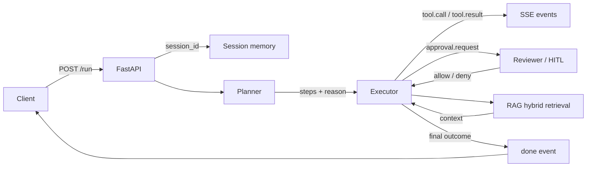

# Architecture

## Overview

A single request flows through three agents; every stage publishes
structured SSE events that clients render as cards, sheets and counters.
The pipeline is stateless between requests except for session memory,
which makes it trivially horizontally scalable behind a gateway.



## Event protocol

Events are sent as `text/event-stream`, one JSON object per event.
The wire format is stable: `event: <type>` + `data: {json}`.

| Event | Payload (key fields) | Meaning |
|---|---|---|
| `agent.start` | `session_id`, `task`, `model` | pipeline started |
| `agent.plan` | `steps[]` `{id, tool, args, requires_approval}` | execution plan |
| `tool.call` | `step_id`, `tool`, `args` | tool invocation started |
| `tool.result` | `step_id`, `tool`, `ok`, `output` | tool completed (or failed) |
| `approval.request` | `action_id`, `step_id`, `tool`, `summary` | HITL gate for risky action |
| `approval.decision` | `action_id`, `decision` | outcome of human review |
| `rag.context` | `query`, `hits[]` | retrieval happened (observability) |
| `token.usage` | `prompt_tokens`, `completion_tokens`, `cost_estimate` | per-LM-call accounting |
| `agent.done` | `summary`, `tool_stats`, `duration_ms` | pipeline finished |
| `agent.error` | `step_id`, `message` | unrecoverable failure |

## Agents

### Planner
- Prompt: system prompt + tool descriptors + task → JSON plan.
- Never executes anything itself. Output is schema-checked (Pydantic);
  invalid plans are retried once.

### Executor
- Runs steps sequentially from the plan against the tool registry.
- Emits `tool.call` before, `tool.result` after each step.
- Pauses on steps marked `requires_approval` and waits for
  `POST /v1/agents/{session_id}/approve` (or timeout → `agent.error`).
- Gathers retrieval context via RAG when the plan includes a
  `retrieve` suitability signal.

### Reviewer
- HITL gate: renders a human-readable summary of the risky action.
- In manual mode the decision is authoritative; the executor either
  continues or marks the step `denied` and adapts.

## Tools

Tools implement a single contract:

```python
class Tool:
    name: str
    description: str
    requires_approval: bool = False
    async def run(self, args: dict) -> dict  # {ok, output}
```

| Tool | Approval | Notes |
|---|---|---|
| `calculator` | no | AST-based safe evaluation, no `eval()` |
| `time.now` | no | deterministic, useful for plan verification |
| `file_store` | **write: yes** | sandboxed to `server/data/sandbox`; directory traversal blocked |
| `web_search` | no (optional) | zero-key DuckDuckGo HTML fetch, best-effort |

## RAG

- Ingest: `data/docs/*.{md,txt}` → chunking (≈512 chars, overlap) →
  store as flat JSON (`data/db/vstore.json`).
- Retrieval: hybrid scoring = cosine(vector) + keyword overlap.
- Embedders: `hash` (zero-key, deterministic — default) or
  OpenAI-compatible `/embeddings` when configured.
- Swap target: implement a 40-line `VectorStore` with a `search()`
  signature (e.g., pgvector, qdrant, sqlite-vss) and wire it in
  `app/rag/retrieve.py`.

## Configuration (env)

| Var | Default | Notes |
|---|---|---|
| `AGENT_LLM_MODE` | `auto` | `auto` → openai if key present, else `stub` |
| `OPENAI_BASE_URL` | — | OpenAI-compatible endpoint |
| `OPENAI_API_KEY` | — | key (omit → stub mode) |
| `AGENT_MODEL` | `gpt-4o-mini` | any OpenAI-compatible model id |
| `AGENT_EMBED_BACKEND` | `hash` | `hash` (zero-key) or `openai` (→ `OPENAI_BASE_URL/embeddings`) |
| `AGENT_EMBED_MODEL` | `text-embedding-3-small` | any model id offered by the `/embeddings` endpoint |
| `AGENT_MCP_MODE` | `off` | `off` \| `demo` (bundled server) \| `stdio:<cmd>` (any MCP server) |
| `AGENT_MCP_TIMEOUT_S` | `60` | per remote tool call timeout |
| `AGENT_TIMEOUT_S` | `120` | executor step timeout |
| `AGENT_APPROVAL_TIMEOUT_S` | `900` | HITL wait timeout |

## MCP (Model Context Protocol)

The agent both *consumes* and *exposes* MCP:

- **Client (out)**: `app/mcp_bridge.py` connects to ANY MCP server over stdio
  (`AGENT_MCP_MODE=stdio:<command>`) and registers every remote tool as
  `mcp_<name>` in the same typed registry the planner sees — so planning,
  HITL approval and SSE events work unchanged. Remote read-only tools flow
  through without approval; mutating tools hit the approval gate. Remote
  input schemas are injected into the planner prompt verbatim.
- **Server (in)**: a bundled MCP server (`scripts/mcp_demo_server.py`,
  `AGENT_MCP_MODE=demo`) simulates an independent, zero-key service
  (`workspace_read` / `workspace_append` on the sandbox) to demonstrate
  the full client path without external credentials.

Design note: the tool adapter pattern means the agent's tool layer is
protocol-agnostic — swap the registry backend and the same planner/executor
loop works against any tool source.